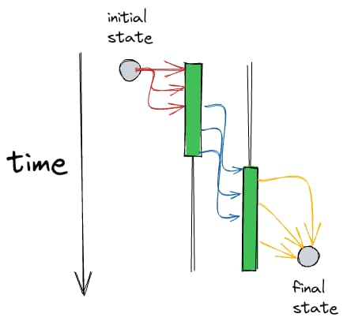
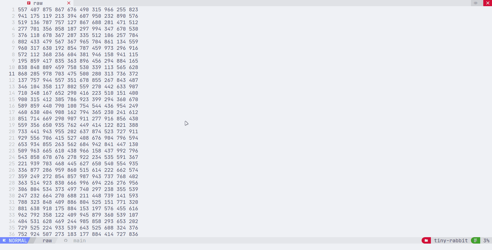

# tiny-rabbit

Toy project solving [Zan's 3rd challenge](https://github.com/zanfranceschi/desafio-03-processamento_distribuido/).

### :pencil: about:

this project is the Hello World of ditributed processing, inside [src/actors](./src/actors/) you can see each application.

- distributor:
> takes the raw data and send chunks to the first queue
- worker:
> take chunks from the first queue, sums them and send to the second queue
- collector:
> aggregates the batches from the same load and display the final sum

<p align="center">
  
</p>

### :gear: running locally: 

make sure that you have RabbitMQ insalled on your machine, or, its [official Docker image](https://hub.docker.com/_/rabbitmq)

```bash
git clone git@github.com:ddanielsantos/tiny-rabbit.git
cd tiny-rabbit

# your preferred package manager
pnpm install

# generates a new file
pnpm create-raw

# each actor is suposed to be a different application
# run each one of them in a different shell, like

pnpm actor:worker
pnpm actor:collector
pnpm actor:distributor
```

### :clapper: demo:



### :whale: todo:
- [ ] setup Dockerfile
- [ ] setup docker.compose
